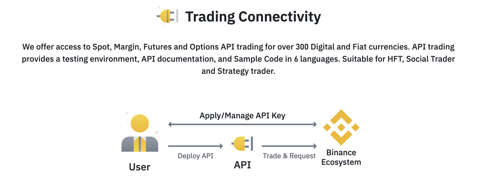
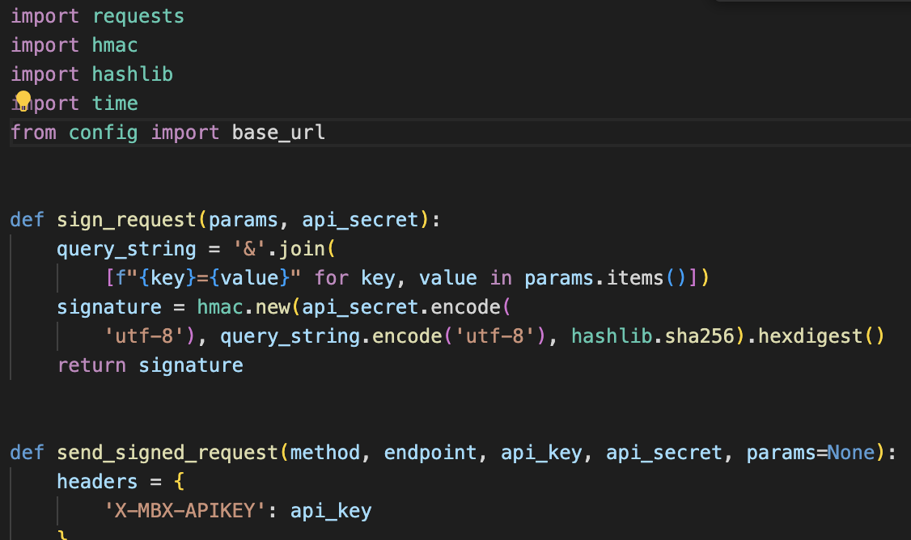
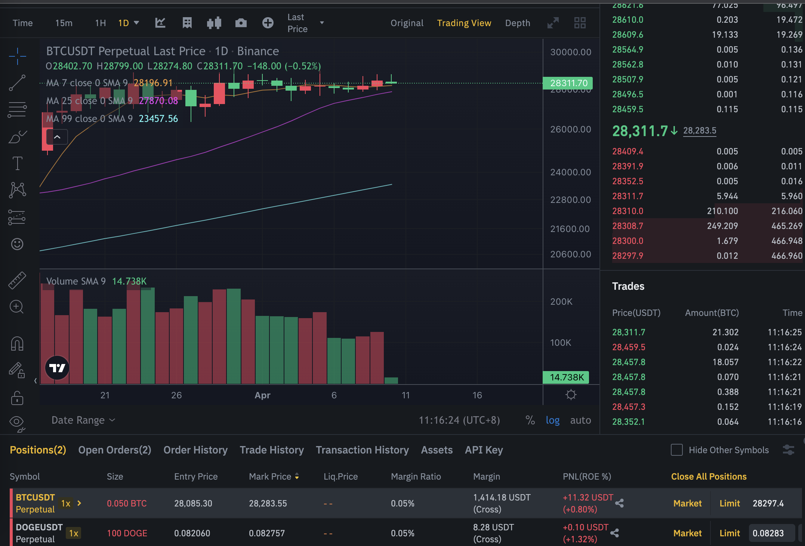

# 基于机器学习的比特币交易策略

---

## 1 背景

### 1.1 数字货币

数字货币是一种基于加密技术和区块链技术的电子货币，可以在网上进行交易和支付。与传统货币不同，数字货币不受任何中央银行或政府的控制，其价值是由市场供需决定的。比特币、以太坊、莱特币等都是数字货币的代表。数字货币的出现，极大地提高了交易效率，降低了跨境交易成本，为全球金融市场带来了重大变革。

---

## 2 任务

### 2.1 为数字货币提供流通性的同时盈利（做市）

做市商是指在数字货币市场中，通过不断地发布买卖委托，为其他市场参与者提供流动性的专业交易者。通过在买卖价格之间设定一个价差，做市商可以从中获得利润。因此，做市商的任务是在保持流动性的同时，通过价差盈利。

---

## 3 数据

### 3.1 调用 Binance API 接口

调用 Binance API 接口（socket触发型+request主动询问）监控 orderbook。为了实现做市策略，需要从交易所获取实时的市场数据。调用 Binance API 接口，可以实时监控 orderbook（订单簿），获取当前市场的买卖委托信息。通过 socket 触发型接口，可以实时接收到市场数据的更新；而通过 request 主动询问接口，则可以根据需要主动查询市场数据。

---

## 4 领域比较好的方法. 多因子模型

### 4.1 预测模型

通过训练机器学习模型，预测市场价格走势或交易量。这可以帮助做市商更好地调整买卖价差，降低风险。常用的预测模型包括支持向量机（SVM）、长短时记忆网络（LSTM）和卷积神经网络（CNN）等。

### 4.2 强化学习

使用强化学习算法，如 Q-learning、Deep Q-Network（DQN）和 Proximal Policy Optimization（PPO）等，训练做市策略。强化学习可以根据市场环境动态调整策略，从而实现最大收益。

### 4.3 高频交易策略

基于机器学习的高频交易策略，可以利用短期内市场微观结构的特点，实现更快速的交易决策。例如，使用协同过滤、聚类分析或者神经网络识别交易模式，并据此进行交易。

---

### 4.4 多因子模型

通过对多种市场因子（如价格、交易量、市场情绪等）进行机器学习分析，构建综合预测模型。这可以帮助做市商更好地理解市场动态，优化买卖决策。

### 4.5 集成学习

利用多个机器学习模型的预测结果进行组合，提高整体预测精度。常用的集成学习方法包括 Bagging、Boosting 和 Stacking 等。

在实践中，可以根据具体的市场环境和交易目标，结合多种机器学习策略，以实现更优的做市和交易效果。

---

## 5 当前进度

### 5.1 部署和连接已完成

成功从 Binance 测试网上拉取数据，证明系统与交易所的连接正常。

---

### 5.2 构建最基本的交易策略

已实现一个简单的交易策略，如附图所示。您可以在演示过程中展示该策略的执行效果，以及与其他策略的对比。

---

## 6 接下来的任务

1. 优化现有交易策略
2. 探索并实现新的机器学习策略
3. 监控和评估策略的实时表现
4. 根据市场变化调整策略参数

---

### 6.1 优化现有交易策略

分析现有交易策略的表现，找出可能的问题和改进空间，以提高策略的收益和稳定性。

### 6.2 探索并实现新的机器学习策略

根据前面提到的领域比较好的方法，尝试实现不同类型的机器学习策略，以进一步提升做市效果。

### 6.3 监控和评估策略的实时表现

实时监控交易策略的执行情况，评估其在不同市场环境下的表现，及时发现问题并进行调整。

### 6.4 根据市场变化调整策略参数

根据市场变化，动态调整策略参数，确保策略在不同市场环境下都能保持良好的表现。

